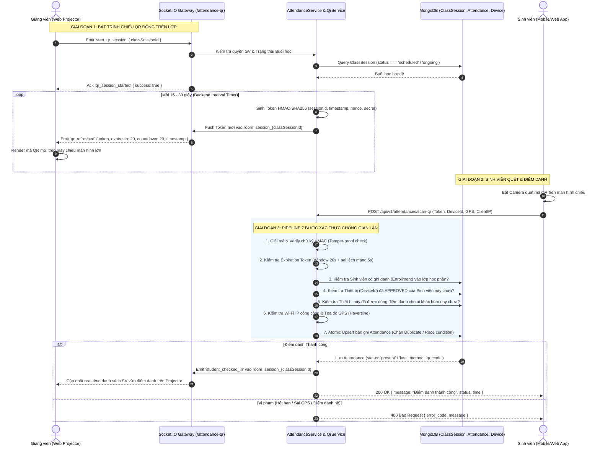

# TÀI LIỆU ĐẶC TẢ KỸ THUẬT & KIẾN TRÚC TRIỂN KHAI
## ĐIỂM DANH BẰNG MÃ QR ĐỘNG (DYNAMIC QR ATTENDANCE)
> **Dự án:** Intelligent Attendance System (Hệ thống điểm danh thông minh)  
> **Các tính năng:** 
> - **Mục 16:** API Sinh mã QR Động (Dynamic QR - HMAC + Timestamp qua Socket.IO)
> - **Mục 17:** API Quét & Xác thực QR Điểm danh (Scan & Verify QR - Chống điểm danh hộ)  
> **Mức độ ưu tiên:** Ưu tiên 1 (Cốt lõi đồ án / Khóa luận tốt nghiệp)

---

## 1. TỔNG QUAN NGHIỆP VỤ & BỐI CẢNH

### 1.1. Vấn đề của phương pháp điểm danh truyền thống & QR tĩnh (Static QR)
- **Điểm danh danh sách giấy / gọi tên:** Tốn 10–15 phút đầu giờ, dễ gây gián đoạn và giảng viên khó bao quát lớp đông (80–150 sinh viên).
- **Mã QR tĩnh (Static QR - in trên giấy hoặc chiếu cố định cả buổi):**
  - **Lỗ hổng nghiêm trọng:** 1 sinh viên có mặt chụp ảnh mã QR rồi gửi qua nhóm Zalo / Messenger / Telegram.
  - Sinh viên ở nhà, quán cà phê hoặc ngủ ở ký túc xá chỉ cần mở ảnh ra quét là hệ thống ghi nhận có mặt.
  - Hoàn toàn vô hiệu hóa mục tiêu giám sát chuyên cần.

### 1.2. Giải pháp: Mã QR Động (Dynamic QR) kết hợp Xác thực Đa tầng
Hệ thống giải quyết triệt để vấn đề bằng mô hình **Dynamic QR Code** tự làm mới liên tục (mỗi 15–30 giây) qua kết nối thời gian thực **WebSocket (Socket.IO)**, kết hợp phòng thủ đa tầng (**Defense-in-Depth**):

```
┌────────────────────────────────────────────────────────────────────────┐
│                   CHIẾN LƯỢC PHÒNG THỦ ĐA TẦNG (5 LỚP)                 │
├────────────────────────────────────────────────────────────────────────┤
│ 1. Token QR Động (HMAC-SHA256): Tự biến thiên sau 15–30s, chống chụp lại│
│ 2. One-Time Replay Protection: Token đã dùng hoặc hết hạn lập tức hủy  │
│ 3. Device Binding: Chỉ thiết bị phần cứng được duyệt mới quét được      │
│ 4. Không gian kép: Bắt buộc cùng Wi-Fi trường (IP) + GPS phòng học (m) │
│ 5. Live Stream Giám sát: Màn hình GV nhảy pop-up real-time khi SV quét  │
└────────────────────────────────────────────────────────────────────────┘
```

---

## 2. SƠ ĐỒ KIẾN TRÚC & LUỒNG HOẠT ĐỘNG (SEQUENCE DIAGRAM)



---

## 3. THUẬT TOÁN & CẤU TRÚC TOKEN QR ĐỘNG (HMAC-SHA256)

### 3.1. Cấu trúc Payload Token
Chuỗi dữ liệu sinh mã QR gồm 2 phần phân tách bằng dấu chấm `.`:
$$\text{QR\_TOKEN} = \text{base64url}(\text{Payload}) + "." + \text{HMAC-SHA256}(\text{Payload}, \text{SECRET\_KEY})$$

**Chi tiết Payload (JSON):**
```json
{
  "sid": "673c09e84b2e8a5b23d91abc",
  "ts": 1741532400000,
  "exp": 1741532420000,
  "nonce": "a7f8b92c",
  "v": 1
}
```
Trong đó:
- `sid` (*Session ID*): MongoDB ObjectId của buổi học `ClassSession`.
- `ts` (*Timestamp*): Thời điểm tạo mã (Epoch millisecond).
- `exp` (*Expire Time*): Thời điểm hết hạn (mặc định = `ts + 20000ms`).
- `nonce` (*Random Salt*): 8 ký tự hex ngẫu nhiên bảo đảm không bao giờ có 2 mã giống nhau dù cùng 1 giây.
- `v` (*Version*): Phiên bản thuật toán (phục vụ nâng cấp trong tương lai).

### 3.2. Thuật toán Ký & Giải mã (Node.js Crypto)
```typescript
import * as crypto from 'crypto';

export class QrSecurityService {
  private readonly QR_SECRET = process.env.QR_HMAC_SECRET || 'attendance-system-super-secret-key-2025';
  private readonly TOLERANCE_WINDOW_MS = 5000; // Cho phép trễ mạng 5 giây

  /**
   * 1. Sinh Token QR Động
   */
  generateToken(classSessionId: string, ttlSeconds: number = 20): string {
    const now = Date.now();
    const payload = {
      sid: classSessionId,
      ts: now,
      exp: now + ttlSeconds * 1000,
      nonce: crypto.randomBytes(4).toString('hex'),
      v: 1,
    };

    const payloadBase64 = Buffer.from(JSON.stringify(payload)).toString('base64url');
    const signature = crypto
      .createHmac('sha256', this.QR_SECRET)
      .update(payloadBase64)
      .digest('hex');

    return `${payloadBase64}.${signature}`;
  }

  /**
   * 2. Giải mã & Xác minh Token
   */
  verifyToken(token: string): { valid: boolean; sessionId?: string; reason?: string } {
    if (!token || !token.includes('.')) {
      return { valid: false, reason: 'INVALID_TOKEN_FORMAT' };
    }

    const [payloadBase64, signature] = token.split('.');
    
    // 1. Kiểm tra chữ ký HMAC
    const expectedSignature = crypto
      .createHmac('sha256', this.QR_SECRET)
      .update(payloadBase64)
      .digest('hex');

    if (!crypto.timingSafeEqual(Buffer.from(signature), Buffer.from(expectedSignature))) {
      return { valid: false, reason: 'SIGNATURE_MISMATCH' };
    }

    // 2. Parse payload
    let payload: any;
    try {
      payload = JSON.parse(Buffer.from(payloadBase64, 'base64url').toString('utf8'));
    } catch {
      return { valid: false, reason: 'CORRUPTED_PAYLOAD' };
    }

    // 3. Kiểm tra thời hạn với độ lệch bù trừ mạng (Tolerance Window)
    const now = Date.now();
    if (now > payload.exp + this.TOLERANCE_WINDOW_MS) {
      return { valid: false, reason: 'TOKEN_EXPIRED' };
    }

    return { valid: true, sessionId: payload.sid };
  }
}
```

---

## 4. ĐẶC TẢ CHI TIẾT MỤC 16: API & SOCKET.IO SINH MÃ QR ĐỘNG

### 4.1. Thông tin Gateway Socket.IO
- **Namespace:** `/attendance-qr`
- **CORS:** `{ origin: '*' }`
- **Xác thực:** Bearer Firebase Token qua Handshake Auth (`auth: { token: '...' }`).
- **Phân quyền:** Chỉ tài khoản có vai trò `teacher` hoặc `admin` mới được mở phòng chiếu QR.

### 4.2. Các sự kiện Socket.IO (Socket Events)

#### A. Client -> Server: `start_qr_stream`
Giảng viên mở màn hình chiếu và yêu cầu server bắt đầu phát chuỗi QR động.
- **Payload:**
```json
{
  "classSessionId": "673c09e84b2e8a5b23d91abc",
  "refreshInterval": 20
}
```
- **Xử lý phía Server:**
  1. Kiểm tra Giảng viên có phải là người dạy buổi học `classSessionId` này không.
  2. Thêm socket client vào room `session_673c09e84b2e8a5b23d91abc`.
  3. Khởi tạo một `NodeJS.Timeout` định kỳ mỗi `refreshInterval` giây (15–30s).
  4. Mỗi chu kỳ, sinh token HMAC mới và phát event `qr_tick`.

#### B. Server -> Client: `qr_tick`
Server gửi token mới kèm thông tin đếm ngược cho máy chiếu.
- **Payload:**
```json
{
  "classSessionId": "673c09e84b2e8a5b23d91abc",
  "token": "eyJzaWQiOiI2NzNjMDllODRiMmU4YTViMjNkOTFhYmMiLCJ0cyI6MTc0MTUzMjQwMDAwMCwiZXhwIjoxNzQxNTMyNDIwMDAwLCJub25jZSI6IjdiZDEyYTk0IiwidiI6MX0.8f1e2a3c...",
  "qrPayload": "eyJzaWQiOiI2NzNjMDllODRiMmU4YTViMjNkOTFhYmMiLCJ0cyI6MTc0MTUzMjQwMDAwMCwiZXhwIjoxNzQxNTMyNDIwMDAwLCJub25jZSI6IjdiZDEyYTk0IiwidiI6MX0.8f1e2a3c...",
  "expiresIn": 20,
  "timestamp": 1741532400000
}
```
*Giao diện Giảng viên:* Dùng thư viện `qrcode.react` render trực tiếp chuỗi `token` thành hình ảnh QR, kèm thanh Progress Bar chạy lùi từ 20s về 0s.

#### C. Server -> Client: `attendance_realtime_update`
Khi có sinh viên quét mã thành công, server push ngay lập tức lên màn hình máy chiếu để GV và cả lớp cùng thấy.
- **Payload:**
```json
{
  "studentId": "673c09e84b2e8a5b23d91001",
  "studentCode": "SV20210045",
  "fullName": "Nguyễn Văn An",
  "avatar": "https://res.cloudinary.com/demo/image/upload/v1/avatar.jpg",
  "checkInTime": "2026-09-09T07:05:12.000Z",
  "status": "present",
  "presentCount": 42,
  "totalStudents": 50
}
```

#### D. Client -> Server: `stop_qr_stream`
Giảng viên đóng cửa sổ điểm danh, server dọn dẹp bộ đếm interval trong RAM để tránh rò rỉ bộ nhớ (Memory Leak).

---

## 5. ĐẶC TẢ CHI TIẾT MỤC 17: API QUÉT & XÁC THỰC QR ĐIỂM DANH

### 5.1. Thông tin Endpoint
- **URL:** `POST /api/v1/attendances/scan-qr`
- **Bảo mật (Guards):** `FirebaseAuthGuard`
- **Vai trò cho phép:** `student`

### 5.2. Request Payload (Body DTO)
```json
{
  "qrToken": "eyJzaWQiOiI2NzNjMDllODRiMmU4YTViMjNkOTFhYmMiLCJ0cyI6MTc0MTUzMjQwMDAwMCwiZXhwIjoxNzQxNTMyNDIwMDAwLCJub25jZSI6IjdiZDEyYTk0IiwidiI6MX0.8f1e2a3c...",
  "deviceId": "web_a4b92c81e9f2a01b",
  "userLat": 21.028511,
  "userLng": 105.854167,
  "accuracy": 8.5,
  "capturedImage": "https://res.cloudinary.com/.../checkin_face.jpg",
  "note": "Quét QR tại giảng đường A2"
}
```

**Bảng chi tiết trường dữ liệu:**
| Trường | Kiểu | Bắt buộc | Ý nghĩa |
|---|---|---|---|
| `qrToken` | `string` | **Có** | Chuỗi token lấy từ camera sau khi quét mã QR |
| `deviceId` | `string` | **Có** | Định danh phần cứng của thiết bị (đã đăng ký trong `user_devices`) |
| `userLat` | `number` | Tùy chọn | Tọa độ GPS vĩ độ (bắt buộc nếu buổi học bật `requireLocationCheck`) |
| `userLng` | `number` | Tùy chọn | Tọa độ GPS kinh độ |
| `accuracy` | `number` | Không | Độ chính xác GPS (bán kính sai số mét) |
| `capturedImage` | `string` | Không | Link ảnh chụp khuôn mặt khi quét (nếu bật liveness check) |
| `note` | `string` | Không | Ghi chú thêm |

---

### 5.3. Pipeline 7 bước xác thực tại Backend (Xử lý chống gian lận)

```
[Nhận Request]
      │
      ▼
1. Giải mã & Verify chữ ký HMAC
   ├─ Sai chữ ký ───────────► 400 Bad Request: "Mã QR giả mạo hoặc không hợp lệ"
   └─ Hết hạn (Sau 20s+5s) ──► 400 Bad Request: "Mã QR đã hết hạn, vui lòng quét mã mới"
      │
      ▼
2. Kiểm tra Buổi học (ClassSession)
   ├─ Không tồn tại / Hủy ──► 404 Not Found: "Buổi học không tồn tại hoặc đã hủy"
   └─ Lấy cấu hình kiểm tra Wi-Fi / GPS / Thời gian tiết học
      │
      ▼
3. Kiểm tra Ghi danh (Enrollment)
   └─ Không có tên trong lớp học phần ──► 403 Forbidden: "Bạn không thuộc danh sách lớp học này"
      │
      ▼
4. Ràng buộc Thiết bị (Device Binding)
   ├─ Chưa phê duyệt thiết bị ────────► 403 Forbidden: "Thiết bị chưa được duyệt đăng ký"
   └─ Thiết bị này đã quét cho SV khác hôm nay? ──► 409 Conflict: "Thiết bị đã dùng điểm danh cho tài khoản khác!"
      │
      ▼
5. Không gian kép (Wi-Fi Public IP & Geofencing GPS)
   ├─ IP không trùng Wi-Fi trường ────► 400 Bad Request: "Chưa kết nối đúng mạng Wi-Fi phòng học"
   └─ Khoảng cách GPS > Radius cho phép ──► 400 Bad Request: "Vị trí nằm ngoài bán kính giảng đường"
      │
      ▼
6. Trạng thái Ca học & Xác định Giờ (Đúng giờ / Đi muộn)
   └─ So sánh giờ quét với `startTime + gracePeriodMinutes` -> Trạng thái: `present` hoặc `late`
      │
      ▼
7. Atomic Database Upsert & Phát Real-time
   ├─ Đã điểm danh vào trước đó? ─────► 400 Bad Request: "Bạn đã điểm danh buổi này rồi"
   ├─ Lưu Attendance record (method: 'qr_code')
   ├─ Push Socket.IO event `attendance_realtime_update` tới màn hình Giảng viên
   └─ Push Firebase Notification tới điện thoại Sinh viên
```

---

### 5.4. Các trường hợp phản hồi API (Responses)

#### A. Thành công (HTTP 200 OK)
```json
{
  "statusCode": 200,
  "success": true,
  "message": "Điểm danh vào thành công (Đúng giờ)!",
  "data": {
    "attendanceId": "673c0bf14b2e8a5b23d91f90",
    "classSessionId": "673c09e84b2e8a5b23d91abc",
    "studentId": "673c09e84b2e8a5b23d91001",
    "status": "present",
    "method": "qr_code",
    "checkInTime": "2026-09-09T07:05:12.124Z",
    "distanceMeters": 12,
    "clientIp": "118.70.190.45"
  }
}
```

#### B. Thất bại do Mã QR hết hạn (HTTP 400 Bad Request)
```json
{
  "statusCode": 400,
  "error": "Bad Request",
  "errorCode": "QR_TOKEN_EXPIRED",
  "message": "Mã QR trên máy chiếu đã được làm mới. Vui lòng quét mã mới nhất trên màn hình."
}
```

#### C. Thất bại do Điểm danh hộ qua Thiết bị lạ / Trùng thiết bị (HTTP 409 Conflict)
```json
{
  "statusCode": 409,
  "error": "Conflict",
  "errorCode": "DEVICE_PROXY_DETECTED",
  "message": "Phát hiện gian lận: Thiết bị này đã được sử dụng để điểm danh cho sinh viên khác trong cùng buổi học!"
}
```

#### D. Thất bại do Không ở trong Giảng đường (GPS ngoài bán kính) (HTTP 400 Bad Request)
```json
{
  "statusCode": 400,
  "error": "Bad Request",
  "errorCode": "LOCATION_OUT_OF_RANGE",
  "message": "Vị trí của bạn (cách 350m) vượt quá bán kính cho phép của giảng đường (50m)."
}
```

---

## 6. MA TRẬN CHỐNG GIAN LẬN & ĐIỂM DANH HỘ (ANTI-FRAUD PLAYBOOK)

Bảng giải pháp tương ứng với mọi kịch bản sinh viên tìm cách qua mặt hệ thống:

| Kịch bản gian lận thực tế | Cách thức sinh viên thực hiện | Cơ chế ngăn chặn của hệ thống | Kết quả |
|---|---|---|---|
| **1. Chụp ảnh gửi Zalo** | Bạn ngồi trong lớp chụp màn hình máy chiếu, gửi ảnh QR vào nhóm chat cho bạn ở nhà quét. | Mã QR hết hạn sau **15–20 giây**. Khi bạn ở nhà nhận ảnh thì mã đã vô hiệu (`QR_TOKEN_EXPIRED`). | ❌ Chặn đứng 100% |
| **2. Livestream / Video Call màn hình** | Sinh viên dùng FaceTime / Google Meet chia sẻ màn hình máy chiếu real-time cho bạn ở nhà quét. | Hệ thống kiểm tra **Wi-Fi Public IP** và **GPS Geofencing**. Sinh viên ở nhà khác dải IP trường hoặc khoảng cách GPS > 50m. | ❌ Bị từ chối tại bước kiểm tra vị trí |
| **3. Điểm danh hộ nhiều máy (1 người quét cho cả nhóm)** | 1 sinh viên mang 1 điện thoại, lần lượt logout ra login tài khoản của các bạn khác để quét. | **Device Binding:** 1 điện thoại gắn với 1 tài khoản chính chủ. Khi phát hiện `deviceId` đã ghi nhận điểm danh cho `studentA`, lập tức khóa không cho điểm danh `studentB` trong cùng session (`DEVICE_PROXY_DETECTED`). | ❌ Bị cảnh báo điểm danh hộ |
| **4. Cầm nhiều điện thoại đi học hộ** | Sinh viên mang 3–4 điện thoại của các bạn khác lên lớp bấm quét. | Màn hình máy chiếu của GV hiển thị **Live Pop-up ảnh đại diện & MSSV** ngay khi quét thành công. GV dễ dàng đối chiếu trực quan sĩ số thực tế với số lượt nhảy trên màn hình. | ⚠️ Kết hợp giám sát thị giác GV |
| **5. Giả lập GPS (Fake GPS)** | Dùng ứng dụng Fake GPS Location trên Android/iOS để đổi vị trí về trường. | **Hàng rào kép:** Bắt buộc đồng thời cả **Public IP của Router Wi-Fi trường** (sinh viên không thể fake IP trường nếu không kết nối vào Access Point thật) + độ trễ mạng. | ❌ Bị chặn bởi IP Check |
| **6. Can thiệp tua ngược giờ hệ thống** | Đổi giờ trên điện thoại sinh viên để kéo dài hạn mã QR. | Thời gian kiểm tra (`now`) được tính hoàn toàn bằng đồng hồ **phía Backend Server**, không tin cậy thời gian gửi từ Client. | ❌ Vô tác dụng |

---

## 7. THIẾT KẾ CẤU TRÚC FILE & CODE TRIỂN KHAI TRONG NESTJS

Để tích hợp vào mã nguồn hiện tại của backend (`intelligent-attendance-system`), khuyến nghị bổ sung các file sau:

```
src/modules/attendance/
├── attendance.controller.ts            # Thêm endpoint POST 'scan-qr'
├── attendance.service.ts               # Thêm logic verify & ghi nhận scanQr()
├── qr-security.service.ts              # [MỚI] Chuyên trách HMAC sinh mã & giải mã
├── qr-attendance.gateway.ts            # [MỚI] WebSocket Gateway phục vụ chiếu QR & Live stream
├── dto/
│   └── scan-qr.dto.ts                  # [MỚI] DTO validate đầu vào quét mã QR
└── schemas/
    └── attendance.schema.ts            # Đã có enum 'qr_code'
```

### 7.1. Mã nguồn mẫu DTO (`src/modules/attendance/dto/scan-qr.dto.ts`)
```typescript
import { ApiProperty, ApiPropertyOptional } from '@nestjs/swagger';
import { IsNotEmpty, IsNumber, IsOptional, IsString } from 'class-validator';

export class ScanQrDto {
  @ApiProperty({ description: 'Chuỗi Token nhận được sau khi quét mã QR', example: 'eyJzaWQiOiI2N...8f1e2a' })
  @IsString()
  @IsNotEmpty({ message: 'Mã QR Token không được để trống' })
  qrToken: string;

  @ApiProperty({ description: 'Định danh phần cứng thiết bị của sinh viên', example: 'device_iphone_15_pro' })
  @IsString()
  @IsNotEmpty({ message: 'Mã định danh thiết bị không được để trống' })
  deviceId: string;

  @ApiPropertyOptional({ description: 'Vĩ độ GPS hiện tại của sinh viên', example: 21.028511 })
  @IsNumber()
  @IsOptional()
  userLat?: number;

  @ApiPropertyOptional({ description: 'Kinh độ GPS hiện tại của sinh viên', example: 105.854167 })
  @IsNumber()
  @IsOptional()
  userLng?: number;

  @ApiPropertyOptional({ description: 'Bán kính sai số GPS (mét)', example: 10 })
  @IsNumber()
  @IsOptional()
  accuracy?: number;

  @ApiPropertyOptional({ description: 'Ảnh chụp minh chứng (nếu có)', example: 'https://cloudinary.com/...' })
  @IsString()
  @IsOptional()
  capturedImage?: string;

  @ApiPropertyOptional({ description: 'Ghi chú thêm từ sinh viên' })
  @IsString()
  @IsOptional()
  note?: string;
}
```

### 7.2. Mã nguồn mẫu Gateway (`src/modules/attendance/qr-attendance.gateway.ts`)
```typescript
import {
  WebSocketGateway,
  WebSocketServer,
  SubscribeMessage,
  MessageBody,
  ConnectedSocket,
  OnGatewayDisconnect,
} from '@nestjs/websockets';
import { Server, Socket } from 'socket.io';
import { Logger, UseGuards } from '@nestjs/common';
import { QrSecurityService } from './qr-security.service';

@WebSocketGateway({
  cors: { origin: '*' },
  namespace: '/attendance-qr',
})
export class QrAttendanceGateway implements OnGatewayDisconnect {
  @WebSocketServer()
  server: Server;

  private readonly logger = new Logger(QrAttendanceGateway.name);
  // Lưu timer interval sinh mã của từng ca học
  private activeTimers = new Map<string, NodeJS.Timeout>();

  constructor(private readonly qrSecurityService: QrSecurityService) {}

  handleDisconnect(client: Socket) {
    this.logger.log(`Client disconnected: ${client.id}`);
  }

  /**
   * Giảng viên bấm bắt đầu phát mã QR
   */
  @SubscribeMessage('start_qr_stream')
  handleStartQrStream(
    @MessageBody() data: { classSessionId: string; intervalSec?: number },
    @ConnectedSocket() client: Socket,
  ) {
    const { classSessionId, intervalSec = 20 } = data;
    const roomName = `session_${classSessionId}`;
    client.join(roomName);

    // Hủy timer cũ nếu có
    if (this.activeTimers.has(classSessionId)) {
      clearInterval(this.activeTimers.get(classSessionId)!);
    }

    // Hàm phát mã QR mới
    const emitNewQr = () => {
      const token = this.qrSecurityService.generateToken(classSessionId, intervalSec);
      this.server.to(roomName).emit('qr_tick', {
        classSessionId,
        token,
        expiresIn: intervalSec,
        timestamp: Date.now(),
      });
    };

    // Phát ngay lập tức mã đầu tiên
    emitNewQr();

    // Lập lịch định kỳ
    const timer = setInterval(emitNewQr, intervalSec * 1000);
    this.activeTimers.set(classSessionId, timer);

    return { success: true, message: `Bắt đầu phát mã QR động mỗi ${intervalSec}s` };
  }

  /**
   * Dừng phát mã QR
   */
  @SubscribeMessage('stop_qr_stream')
  handleStopQrStream(@MessageBody() data: { classSessionId: string }) {
    if (this.activeTimers.has(data.classSessionId)) {
      clearInterval(this.activeTimers.get(data.classSessionId)!);
      this.activeTimers.delete(data.classSessionId);
    }
    return { success: true, message: 'Đã dừng phát mã QR' };
  }

  /**
   * Phát kết quả điểm danh thành công của SV lên máy chiếu
   */
  broadcastLiveCheckIn(classSessionId: string, studentData: any) {
    this.server.to(`session_${classSessionId}`).emit('attendance_realtime_update', studentData);
  }
}
```

---

## 8. ĐẶC TẢ CHI TIẾT GIAO DIỆN FRONTEND (UI/UX & COMPONENT ARCHITECTURE)

Dựa trên công nghệ Frontend hiện tại của dự án (**Next.js 16 App Router, React 19, Tailwind CSS v4, Lucide React, Socket.IO Client, Sonner, Radix UI**), hệ thống chia làm 2 phân hệ giao diện chính:

```
┌──────────────────────────────────────────────────────────────────────────────┐
│                            PHÂN HỆ GIAO DIỆN FRONTEND                         │
├──────────────────────────────────────┬───────────────────────────────────────┤
│ 🖥️ GIẢNG VIÊN (PROJECTOR / DESKTOP)  │ 📱 SINH VIÊN (MOBILE / RESPONSIVE)    │
├──────────────────────────────────────┼───────────────────────────────────────┤
│ 1. Màn hình Chiếu QR Toàn màn hình   │ 1. Nút "Quét QR Buổi học" trên Card   │
│ 2. QR Code to + Thanh đếm ngược 20s  │ 2. Camera Scanner Viewfinder + Laser  │
│ 3. Feed Live Stream SV vừa quét      │ 3. Pre-check ngầm GPS + WiFi + Device │
│ 4. Thống kê Sĩ số Real-time (42/50)  │ 4. Modal Pop-up Kết quả Confetti      │
└──────────────────────────────────────┴───────────────────────────────────────┘
```

---

### 8.1. Màn hình Trình chiếu Giảng viên (Lecturer Projector Screen)

Giao diện được thiết kế tối ưu cho tỷ lệ màn hình máy chiếu **16:9** hoặc **4:3**, hỗ trợ chế độ **Fullscreen (F11)**, độ tương phản cao để sinh viên ngồi cuối giảng đường (cách 15–25m) vẫn quét rõ nét.

#### A. Wireframe Bố cục (Layout Wireframe)
```
┌─────────────────────────────────────────────────────────────────────────────┐
│ 🎓 LẬP TRÌNH WEB NÂNG CAO - IT002.N11 | 📍 Phòng: A2.304 | ⏰ Tiết: 1 - 3    │
├────────────────────────────────────────┬────────────────────────────────────┤
│                                        │ 📊 SĨ SỐ LỚP: 42 / 50 (84%)        │
│          MÃ QR ĐIỂM DANH               │ [████████████████████░░░░] 84%     │
│                                        │ ✅ Đúng giờ: 38  | ⚠️ Đi muộn: 4   │
│     ┌────────────────────────────┐     ├────────────────────────────────────┤
│     │                            │     │ ⚡ DANH SÁCH VỪA QUÉT (LIVE FEED)   │
│     │     [ DYNAMIC QR CODE ]    │     │ ┌────────────────────────────────┐ │
│     │       (Kích thước lớn)     │     │ │ 🟢 07:05:12 - Nguyễn Văn An    │ │
│     │                            │     │ │    MSSV: 21520001 (Đúng giờ)   │ │
│     └────────────────────────────┘     │ ├────────────────────────────────┤ │
│                                        │ │ 🟢 07:05:08 - Trần Thị Mai     │ │
│  ⏳ Tự động làm mới sau: [ 14s ]        │ │    MSSV: 21520015 (Đúng giờ)   │ │
│  [===================>.........]       │ ├────────────────────────────────┤ │
│                                        │ │ 🟡 07:04:55 - Lê Hoàng Long    │ │
│  🔴 [Dừng điểm danh]   🖥️ [Toàn màn hình]│ │    MSSV: 21520088 (Muộn 5p)    │ │
│                                        │ └────────────────────────────────┘ │
└────────────────────────────────────────┴────────────────────────────────────┘
```

#### B. Các thành phần UI cốt lõi (Core UI Components):
1. **Thẻ QR Code Trung tâm (`DynamicQrCard.tsx`):**
   - Render bằng `qrcode.react` (chuẩn SVG/Canvas, `level="H"` - High Error Correction).
   - Hiệu ứng chuyển động (Motion): Khi token đổi mới mỗi 20s, QR code có hiệu ứng mờ dần nhẹ (*fade transition*) kết hợp viền đèn Neon nhấp nháy 1 nhịp thông báo mã mới.
   - **Progress Bar đếm ngược (Countdown Timer):** Chạy mượt mà từ 20s về 0s. 
     - Màu sắc: Xanh lá (20s - 10s) $\rightarrow$ Vàng cam (10s - 5s) $\rightarrow$ Đỏ nhấp nháy (dưới 5s).
2. **Live Attendance Stream Feed (`LiveAttendanceFeed.tsx`):**
   - Lắng nghe Socket event `attendance_realtime_update`.
   - Mỗi sinh viên quét thành công sẽ trượt từ trên xuống (*Slide-down Animation*) kèm âm thanh thông báo nhẹ (*optional sound ding*).
   - Thẻ sinh viên hiển thị: Avatar Cloudinary, Họ tên, MSSV, Thời gian chính xác đến từng giây, Badge trạng thái xanh/vàng.
3. **Thống kê Sĩ số Nhanh (`AttendanceStatsSummary.tsx`):**
   - Bộ đếm nhảy số thời gian thực (*Animated Number Counter*).
   - Thanh tiến trình tổng thể lớp học (% sinh viên đã có mặt).

---

### 8.2. Màn hình Quét mã Sinh viên (Student Mobile Scanner View)

Giao diện tối ưu cho thiết bị di động (Mobile Web / PWA / Responsive Smartphone).

#### A. Wireframe Luồng Quét & Xác thực
```
┌───────────────────────────────┐      ┌───────────────────────────────┐
│ 📱 ĐIỂM DANH BUỔI HỌC         │      │ 📸 CAMERA QUÉT MÃ QR          │
├───────────────────────────────┤      ├───────────────────────────────┤
│ 📚 Lập trình Web nâng cao     │      │ ┌───────────────────────────┐ │
│ 👨‍🏫 GV: TS. Nguyễn Văn A       │      │ │   ┌─                 ─┐   │ │
│ 📍 Phòng A2.304 | Tiết 1 - 3  │      │ │         [ LASER ]         │ │
│ ───────────────────────────── │      │ │   │     ───────     │   │ │
│ 📡 Trạng thái sẵn sàng:       │      │ │   └─                 ─┘   │ │
│   ✅ Đã kết nối Wi-Fi Trường   │      │ └───────────────────────────┘ │
│   ✅ GPS: Trong phòng (8m)    │      │ 💡 [Bật Đèn Flash]  🔄 [Đổi Cam]│
│   ✅ Thiết bị: Đã xác thực    │      │ ───────────────────────────── │
│                               │      │ ⚠️ Hướng camera về màn hình   │
│ ┌───────────────────────────┐ │      │    máy chiếu của Giảng viên   │
│ │ 📸 QUÉT QR ĐIỂM DANH      │ │      └───────────────────────────────┘
│ └───────────────────────────┘ │                      │ (Quét thành công)
└───────────────────────────────┘                      ▼
                                       ┌───────────────────────────────┐
                                       │ 🎉 ĐIỂM DANH THÀNH CÔNG!      │
                                       ├───────────────────────────────┤
                                       │         ✅ (Icon Xanh)        │
                                       │     NGUYỄN VĂN AN (21520001)  │
                                       │                               │
                                       │ ⏰ Thời gian: 07:05:12        │
                                       │ 📌 Trạng thái: ĐÚNG GIỜ       │
                                       │ 📍 Vị trí: Giảng đường A2.304 │
                                       │ 🛡️ Phương thức: Mã QR Động    │
                                       │                               │
                                       │    [ Quay lại Lịch học ]      │
                                       └───────────────────────────────┘
```

#### B. Các thành phần & Trải nghiệm người dùng (UX Elements):
1. **Kiểm tra Điều kiện Tiên quyết Ngầm (Background Pre-Flight Checks):**
   - Trước khi mở camera, màn hình tự động chạy 3 kiểm tra:
     - 📶 **Wi-Fi:** Lấy Public IP hiện tại qua endpoint `/attendances/config`.
     - 🛰️ **GPS:** Gọi `navigator.geolocation.getCurrentPosition` lấy tọa độ vĩ độ/kinh độ và độ chính xác (accuracy).
     - 📱 **Device:** Lấy `deviceId` lưu trong LocalStorage từ bước đăng nhập/duyệt thiết bị.
   - Nếu điều kiện nào chưa đạt (VD chưa bật định vị GPS), nút quét sẽ mờ và hiện hướng dẫn bật GPS.
2. **Camera Scanner Viewfinder (`QrScannerModal.tsx`):**
   - Tích hợp thư viện quét mã `html5-qrcode` tốc độ cao (nhận diện trong < 100ms).
   - Khung ngắm hình vuông với 4 góc viền sáng và tia quét laser quét chuyển động lên xuống.
   - Có nút **Bật Flash** (hỗ trợ phòng học tối) và **Đổi Camera trước/sau**.
3. **Modal Kết quả & Hiệu ứng Chúc mừng (`ScanSuccessModal.tsx`):**
   - Khi API `POST /attendances/scan-qr` trả về `200 OK`:
     - Bắn pháo hoa hiệu ứng Confetti (`canvas-confetti`).
     - Rung nhẹ thiết bị (`navigator.vibrate([100, 50, 100])` trên điện thoại).
     - Hiển thị tóm tắt thông tin: Họ tên, Môn học, Thời gian, Trạng thái Điểm danh.
   - Khi API trả về lỗi:
     - Hiện Pop-up cảnh báo màu đỏ với hướng dẫn xử lý cụ thể:
       - *Mã hết hạn:* "Mã QR vừa được làm mới, vui lòng giữ camera hướng vào màn hình chiếu để quét mã mới".
       - *Sai vị trí:* "Bạn đang ở ngoài phạm vi giảng đường (Cách 120m)".
       - *Điểm danh hộ:* "Thiết bị này đã được sử dụng điểm danh cho tài khoản khác".

---

### 8.3. Cấu trúc Thư mục Frontend Đề xuất trong Dự án (`intelligent-attendance-web-app`)

```
src/
├── app/(main)/dashboard/attendance/
│   ├── page.tsx                           # Trang chính Quản lý Điểm danh (Cập nhật tabs)
│   ├── _components/
│   │   ├── lecturer/
│   │   │   ├── QrProjectorModal.tsx       # [MỚI] Modal Màn hình chiếu QR Toàn màn hình cho GV
│   │   │   ├── DynamicQrDisplay.tsx       # [MỚI] Component render QR Code + Countdown Bar
│   │   │   └── LiveAttendanceFeed.tsx     # [MỚI] Feed danh sách sinh viên vừa quét thời gian thực
│   │   └── student/
│   │       ├── QrScannerModal.tsx         # [MỚI] Modal bật Camera quét mã QR
│   │       ├── ScannerViewfinder.tsx      # [MỚI] Khung quét laser + nút Flash
│   │       └── ScanResultModal.tsx        # [MỚI] Modal thông báo thành công / thất bại kèm Confetti
├── hooks/
│   ├── useQrAttendanceSocket.ts           # [MỚI] Custom hook quản lý Socket.IO cho cả GV và SV
│   └── useDeviceFingerprint.ts            # Hook lấy mã định danh phần cứng thiết bị
└── services/
    └── attendance.service.ts              # Bổ sung hàm scanQrAttendance(payload)
```

---

## 9. KẾT LUẬN & ĐÁNH GIÁ ĐỒ ÁN
1. **Tính độc đáo & Khoa học:** Không sử dụng thư viện bên thứ 3 phức tạp, kiến trúc tận dụng trực tiếp chuẩn mã hóa mật mã học **HMAC-SHA256** kết hợp giao thức truyền thông hai chiều thời gian thực **Socket.IO**.
2. **Tính thực tiễn cao:** Đáp ứng trọn vẹn tiêu chuẩn chấm điểm đồ án tốt nghiệp về khả năng giải quyết bài toán chống gian lận, điểm danh hộ học đường bằng giải pháp công nghệ hiện đại.
3. **Hiệu năng cao:** Tính toán token hoàn toàn theo cơ chế phi trạng thái (*stateless* - giải mã trực tiếp từ chữ ký số mà không cần query cache Redis liên tục), giúp hệ thống dễ dàng chịu tải hàng trăm sinh viên quét cùng 1 giây mà không nghẽn CSDL.
4. **Trải nghiệm người dùng (UX) hiện đại:** Thiết kế đồng bộ giữa màn hình lớn Projector của Giảng viên và màn hình Camera di động của Sinh viên, mang lại trải nghiệm chuyên nghiệp, mượt mà và trực quan.
